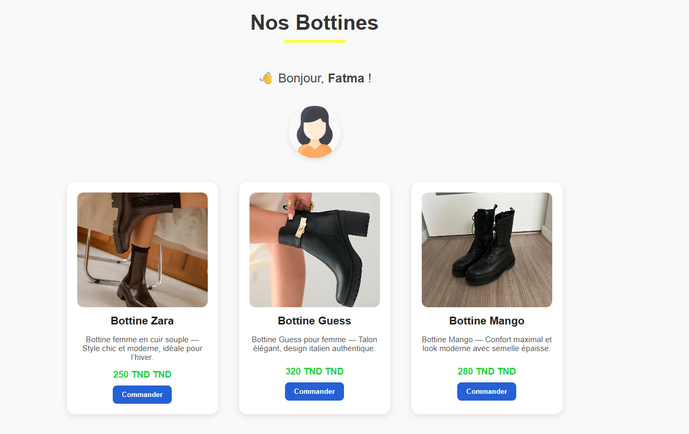

# 👢 Projet React — Boutique de Bottines

## 📝 Description

Ce projet est une petite application **React** qui affiche une collection de bottines pour femmes.  
Chaque produit contient une **image**, un **nom**, une **description**, un **prix**, et un **bouton “Commander”**.  

Le projet a été réalisé en utilisant la **modularisation des composants React** :  
chaque partie du produit (nom, prix, description, image) est gérée par un composant séparé.  

---

## 🧱 Structure du projet

```
src/
│
├── App.js                 → Composant principal qui affiche tous les produits
├── App.css                → Styles globaux de l’application
│
├── products.js            → Tableau contenant les données des produits
│
├── Produitscard.js        → Composant qui assemble tous les sous-composants
├── Produitscard.css       → Styles spécifiques des cartes produits
│
├── Name.js                → Composant qui affiche le nom du produit
├── Price.js               → Composant qui affiche le prix du produit
├── Description.js          → Composant qui affiche la description du produit
├── Image.js               → Composant qui affiche l’image du produit
│
└── index.js               → Point d’entrée principal de React
```

---

## ⚙️ Installation et exécution

### 1️⃣ Cloner le projet
```bash
git clone https://github.com/ton-compte/nom-du-projet.git
```

### 2️⃣ Se déplacer dans le dossier
```bash
cd nom-du-projet
```

### 3️⃣ Installer les dépendances
```bash
npm install
```

### 4️⃣ Lancer le projet
```bash
npm start
```

Le projet sera lancé sur **http://localhost:3000** 🌐

---

## 💡 Fonctionnement

- Le composant `App.js` importe la liste des produits depuis `products.js`.
- Pour chaque produit, `App.js` affiche un composant `ProductCard`.
- Le composant `ProductCard` utilise quatre sous-composants :
  - **Image.js** → Affiche la photo du produit.
  - **Name.js** → Affiche le nom du produit.
  - **Description.js** → Montre la description du produit.
  - **Price.js** → Indique le prix du produit.

---

## 🎨 Exemple de rendu

Chaque produit apparaît sous la forme d’une carte :

```
+------------------------------+
|           [Image]            |
|   Bottine Zara               |
|   Bottine en cuir souple...  |
|   250 TND                    |
|   [ Commander ]              |
+------------------------------+
```
## 🖼️ Capture d’écran du projet

Voici un aperçu de l’application en fonctionnement :



---

## 🧠 Objectifs pédagogiques

✅ Comprendre la **structure d’un projet React**  
✅ Apprendre à **créer et exporter plusieurs composants**  
✅ Savoir **importer et combiner des composants**  
✅ Appliquer des **styles CSS personnalisés**  
✅ Utiliser les **props** pour passer des données entre composants  

---

## 👩‍💻 Auteur

**Fatma Chenkaoui**  
Étudiante en développement web — Projet React JSX  
📅 2025  
